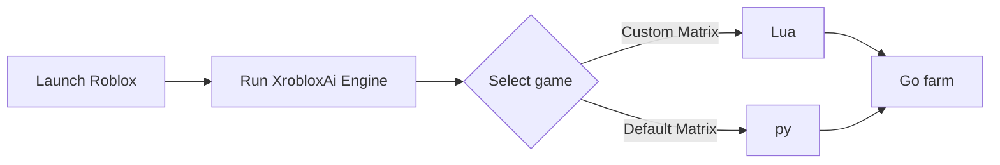

# 🌸 Roblox AI-Helper App / Assistant / Open-Luau Automation / 4 Game

## ⚙️ Workflow Diagram

  <!-- Кликабельные кнопки (Оранжевый индустриальный стиль) -->
  
  

An open-source research environment for embedding and executing custom **Luau** scripts within interactive 3D engines. This toolkit provides a sandboxed execution runtime, event listening interfaces, and input state simulation for testing gameplay mechanics.

> **Disclaimer:** This project is designed strictly for educational research, game engine plugin development, and sandboxed script execution testing.

---

## 🛠 Features

Luau Script Workbench: Built-in editor with syntax highlighting, quick preset loading, and direct script execution simulation thread.

Spatial Telemetry & Radar: Real-time vector coordinate mapping, entity proximity scanning, and spatial diagnostic overlays.

Physics & Movement Simulation: Configurable velocity multipliers, jump parameters, and movement calibration helpers for Luau physics testing.

Modular Preset Selector: Quick switching between custom game presets and scripting templates (Blox Fruits, Pet Simulator X, Blade Ball, Universal ESP).

Modern Frameless UI: Single-file Python/pywebview architecture featuring hardware-accelerated rendering, ambient glows, and interactive diagnostic logs.
  
---

`roblox`,  `yolov8`, `automation`, `automation-framework`, `real-time-processing`, `lua`, `object-detection` , `game-scripts` , `murder-mystery` , `mm2` , `blade-ball` , `blox-fruits-game`

<!-- update: B -->